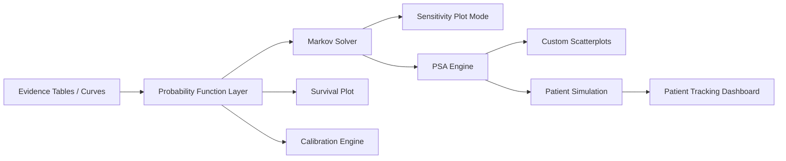

# TreeAge 六大能力 PRD 与技术任务拆解

更新时间：2026-03-25
适用版本：Platform v1.0 planning draft

## 1. 文档目标

把以下 6 个能力翻译成可执行的产品需求和研发任务：

1. 利用临床数据校准马尔可夫模型
2. 马尔可夫图和生存图的敏感性分析模式
3. 拉丁超立方抽样用于 PSA
4. 马尔可夫患者追踪队列仪表盘
5. 自定义模拟散点图
6. 利用表格和复合曲线计算事件概率

本文不是研究综述，而是供产品、算法、后端、前端、QA 进入实施排期使用。

## 2. 产品定义

### 2.1 产品一句话

一个面向 HEOR / HTA 团队的在线建模与分析平台，支持证据输入、可视化建模、Markov/PartSA/PSA 计算、临床校准、患者追踪和可审计分享。

### 2.2 目标用户

1. 药企 HEOR / market access 团队
2. 咨询公司卫生经济学建模团队
3. 医学院校 HTA / decision modeling 研究者
4. payer / reviewer / 审阅方

### 2.3 产品目标

- 让用户把临床证据更标准化地转成模型输入
- 让 Markov 与 survival 驱动模型更容易校准和解释
- 让 PSA 和 patient simulation 的结果更高效、更可探索
- 让运行结果具备审阅、追踪、复现和导出能力

### 2.4 非目标

- 首版不覆盖完整 business/law 决策分析场景
- 首版不支持全量 DES 资源约束建模
- 首版不支持复杂多终点联合 calibration
- 首版不做完整 Excel 双向实时同步

## 3. 统一产品原则

### 3.1 数据和运行原则

- 所有模型运行必须绑定不可变 `model_version`
- 所有运行必须保存 `input_snapshot`
- 所有随机模拟必须保存 `random_seed` 与 `sampling_method`
- 所有图表必须能回溯到 `run_id`

### 3.2 体验原则

- 先有标准对象，再有图表和快捷入口
- 图表不是静态报告，而是模型对象的视图
- 高级能力优先提供 wizard，再提供 advanced panel

### 3.3 合规与审阅原则

- 证据数据与模型参数要可溯源
- 运行和校准结果要可审计
- 共享链接必须可控授权，不允许默认无限编辑

## 4. 能力总览

| 能力 | 用户价值 | 平台核心对象 | 首版优先级 |
|---|---|---|---|
| 临床校准 | 提高模型拟合与可信度 | calibration job / target data / candidate params | P1 |
| Plot sensitivity | 直观看参数影响 | plot scenario / low-base-high curve set | P1 |
| LHS for PSA | 提升抽样效率 | psa design / sampler / sample set | P1 |
| Patient tracking dashboard | 解释患者流动与结构合理性 | patient event log / cohort aggregation | P2 |
| Custom scatterplot | 探索关系与异常 | metrics catalog / run metric value | P1 |
| Event probability functions | 证据转输入的基础能力 | evidence table / curve / probability function | P0 |

## 5. Feature A: 临床数据校准马尔可夫模型

### 5.1 要解决的问题

用户通常需要将 KM 曲线、生存表或真实世界临床数据拟合到马尔可夫模型的转移参数。传统做法依赖手工调参，效率低、透明度差、复现困难。

### 5.2 目标

- 支持把临床生存数据作为 calibration target
- 支持对一组待校准参数在边界条件下自动搜索
- 输出最优参数、拟合优度、曲线对比和运行日志

### 5.3 首版范围

- 支持 cohort Markov
- 支持输入 KM table / survival table
- 支持单终点或双终点目标曲线
- 支持参数边界、初值、固定参数
- 支持 weighted SSE 目标函数
- 支持全局搜索 + 局部细化两阶段优化

### 5.4 暂不做

- 多模型联合 calibration
- Bayesian calibration
- 多终点 likelihood-based 高级拟合
- patient-level microsimulation calibration

### 5.5 用户故事

- 作为建模师，我希望上传 KM table 并选择要拟合的 Markov 转移参数，这样我可以快速得到更贴合临床数据的模型。
- 作为审阅者，我希望看到目标数据与模型输出曲线叠加图，以及参数边界和优化日志，这样我能判断拟合是否可信。

### 5.6 核心流程

1. 用户选择一个 `model_version`
2. 用户上传或选择已有 `clinical evidence table`
3. 用户选择 target endpoint 和 target time unit
4. 用户勾选可校准参数，并设置 lower/upper bound、initial guess
5. 用户选择目标函数与优化方式
6. 系统启动 calibration job
7. 作业完成后输出 best-fit params、fit score、overlay plot、run log
8. 用户可选择“保存为新版本参数集”

### 5.7 关键对象

- `ClinicalSeries`
- `CalibrationConfig`
- `CalibrationTarget`
- `CalibrationParameter`
- `CalibrationRun`
- `CalibrationResult`

### 5.8 功能需求

#### 输入

- KM table / survival table
- 目标时间单位
- 待校准参数列表
- 参数上下界
- 初始值
- 优化算法
- 最大迭代次数

#### 输出

- 最优参数值
- 目标函数值
- 收敛状态
- 曲线叠加图
- 参数敏感度摘要
- 参数集保存按钮

### 5.9 关键规则

- 只允许校准被标记为 `calibratable=true` 的连续参数
- 参数边界必填，且 `lower < upper`
- 校准生成的新参数集不能覆盖原版本，必须保存为新版本或派生参数集
- 若模型运行失败，必须保留失败日志和最后一组候选参数

### 5.10 验收标准

- 给定 benchmark 模型和目标曲线，可在限定迭代内输出收敛结果
- 可视化叠加图能显示 observed vs predicted
- 结果页可回看参数边界、初值、算法、耗时、拟合分数
- 用户可一键将拟合结果写入新参数集并重新运行标准分析

### 5.11 研发任务拆解

#### 后端

- 新增 evidence table 存储与解析
- 新增 calibration job schema
- 实现 objective evaluation pipeline
- 实现 `global search -> local refine` 优化器管道
- 支持 calibration result 持久化

#### 前端

- calibration wizard
- 参数选择与 bound 配置表
- overlay plot 页面
- “应用到新参数集”交互

#### 算法

- KM/survival table 标准化
- survival-to-model endpoint 对齐
- weighted SSE 目标函数
- 优化器适配层

#### QA

- benchmark 结果回归
- 非法参数边界
- 缺失 target data
- 校准中断/重试

## 6. Feature B: 马尔可夫图和生存图的敏感性分析模式

### 6.1 要解决的问题

传统敏感性分析多停留在 ICER、NMB 或 tornado。用户无法直观看到某个参数变化如何改变队列状态轨迹或 survival curve。

### 6.2 目标

- 在 Markov Plot / Survival Plot 中直接显示参数 low/base/high 对曲线的影响
- 支持临床讨论和模型解释

### 6.3 首版范围

- 单参数敏感性分析
- base / low / high 三条曲线
- 支持 state occupancy、survival、cumulative events
- 支持导出 PNG / CSV

### 6.4 用户故事

- 作为建模师，我想看某个转移概率上下浮动后，队列分布曲线怎么变。
- 作为临床合作者，我想看某个 hazard 参数变化后生存曲线如何偏移。

### 6.5 核心流程

1. 用户进入 Plot 页面
2. 切换 `Sensitivity Mode`
3. 选择一个输入参数
4. 填写 low/base/high 或引用现有区间
5. 系统并行生成 3 套 plot series
6. 页面叠加展示并支持 hover 对比

### 6.6 功能需求

- 参数搜索与筛选
- low/base/high 手工输入或从参数定义加载
- 叠加图例
- 差值摘要
- 导出图像和明细数据

### 6.7 关键规则

- 只允许数值型参数进入 sensitivity mode
- 图表运行应绑定同一 `model_version`
- 三条曲线必须使用相同随机种子或 deterministic mode，以免引入额外波动

### 6.8 验收标准

- 单个参数改动后，三条曲线能稳定叠加显示
- 导出数据包含 scenario label 和曲线点
- 当参数非法或模型失败时，前端清晰提示失败 scenario

### 6.9 研发任务拆解

#### 后端

- plot scenario API
- 同模型多 scenario 批量运行接口
- plot cache

#### 前端

- sensitivity mode toggle
- 参数面板
- 叠加曲线 legend 与 compare tooltip

#### QA

- deterministic Markov plot
- survival plot with event probability function
- export consistency

## 7. Feature C: PSA 的拉丁超立方抽样

### 7.1 要解决的问题

普通随机抽样在高维参数空间覆盖不均匀，导致 PSA 收敛较慢、样本数需求较高。

### 7.2 目标

- 为 PSA 提供 `random` 和 `lhs` 两种采样方式
- 在相同样本量下提高抽样覆盖均匀性和结果稳定性

### 7.3 首版范围

- 独立参数的 LHS
- 支持常见分布：Beta、Gamma、LogNormal、Normal、Dirichlet
- 支持固定随机种子
- 支持样本导出

### 7.4 暂不做

- 相关参数的 Iman-Conover 重排
- Sobol / quasi-Monte Carlo
- adaptive sample size

### 7.5 用户故事

- 作为建模师，我希望用较少 PSA 样本快速得到稳定的 CEAC 和 ICE 散点结果。
- 作为方法学专家，我希望知道本次 PSA 的采样方式和种子，以便复现。

### 7.6 核心流程

1. 用户创建 PSA design
2. 选择 sample size
3. 选择 sampling method: random / lhs
4. 系统生成 sample set 并执行模型
5. 输出 CEAC、ICE、summary、样本下载

### 7.7 功能需求

- sampling method selector
- sample set generation log
- seed persistence
- run comparison view

### 7.8 关键规则

- LHS 按参数维度分层后必须随机置换
- 采样方式必须持久化到 run metadata
- 相同模型、参数、样本数、seed、method 应可复现同一 sample set

### 7.9 验收标准

- 同样本数下，LHS 与 random 输出可比较
- seed 固定时重复运行样本一致
- 用户可下载样本矩阵

### 7.10 研发任务拆解

#### 后端

- sampler interface
- random sampler
- lhs sampler
- sample set persistence

#### 前端

- PSA config panel
- method badge
- sample download

#### QA

- reproducibility tests
- distribution inverse-CDF correctness
- large sample performance

## 8. Feature D: 马尔可夫患者追踪队列仪表盘

### 8.1 要解决的问题

用户往往只能看到 microsimulation 的汇总结果，无法理解患者在状态间如何流动，也难以及时发现不合理转移。

### 8.2 目标

- 将 patient-level track 聚合为 cohort dashboard
- 支持按时间观察状态占比、流入流出和关键事件

### 8.3 首版范围

- 仅支持 patient simulation / microsimulation 输出
- 支持 state occupancy over time
- 支持 transition heatmap
- 支持 collapse states
- 支持患者样本 drill-down

### 8.4 依赖

- 必须已有 patient event log
- 必须已有 state timestamp / cycle index

### 8.5 用户故事

- 作为建模师，我希望快速看到患者队列在各状态中的迁移轨迹，以便检查模型结构是否符合临床路径。
- 作为审阅者，我希望 drill down 到单个患者样本，确认极端结果是否有合理轨迹。

### 8.6 核心流程

1. 用户运行 patient simulation
2. 系统写入 patient event log
3. 用户打开 dashboard
4. 系统按时间窗口和状态分组聚合
5. 用户切换 cohort、subgroup、collapsed state views
6. 用户点击异常时间点进入 sample drill-down

### 8.7 功能需求

- occupancy chart
- transition matrix / heatmap
- subgroup filter
- patient sample trace viewer
- export aggregated cohort table

### 8.8 关键规则

- 聚合不能覆盖原始 patient event log
- collapse state 只能作用于可配置 grouping，不修改底层状态定义
- patient-level 数据默认需要权限控制

### 8.9 验收标准

- 同一 run 可回看 cohort dashboard
- 支持 10 万级 patient event records 的聚合查询
- 选定异常点后可 drill down 到患者级轨迹

### 8.10 研发任务拆解

#### 后端

- patient event schema
- cohort aggregate materialization
- subgroup query API

#### 前端

- dashboard 页面
- collapse state config
- patient drill-down panel

#### QA

- aggregation correctness
- large run performance
- permission isolation

## 9. Feature E: 自定义模拟散点图

### 9.1 要解决的问题

用户想探索任意输入变量和输出结果之间的关系，但标准报表只提供固定图形，难以发现异常点或隐含相关性。

### 9.2 目标

- 任意选择两个 metrics 绘制散点图
- 支持输入样本、输出结果、增量结果混合选择

### 9.3 首版范围

- PSA 和 patient simulation run
- x/y 轴可从 metrics catalog 中选择
- 支持颜色分组、异常点 hover、相关系数

### 9.4 用户故事

- 作为建模师，我想画出参数样本值和 NMB 的散点图，看是否有阈值关系。
- 作为方法学同事，我想看增量成本和某个输入参数的关系，定位异常 run。

### 9.5 核心流程

1. 用户打开某个 run 的 scatterplot view
2. 系统加载可选 metrics catalog
3. 用户选择 x/y 和颜色分组字段
4. 系统返回 point set 和 summary stats
5. 用户 hover 点查看 sample 明细

### 9.6 功能需求

- metrics catalog
- metrics search
- scatterplot render
- Pearson / Spearman 摘要
- sample detail popover

### 9.7 关键规则

- 所有可视化 metric 必须来自可追溯 run data
- 若 metric 是增量结果，必须标明 comparator / strategy
- 大样本散点图需要抽样显示或 density mode

### 9.8 验收标准

- 用户能从单个 run 中选择任意两个已索引指标绘图
- hover 能定位到具体 sample_id
- 大于 5 万点时前端仍可交互

### 9.9 研发任务拆解

#### 后端

- metrics catalog builder
- sample metric query API
- sampled rendering API

#### 前端

- metric picker
- scatterplot canvas/webgl rendering
- correlation summary card

#### QA

- metric lineage correctness
- big scatter rendering
- export CSV consistency

## 10. Feature F: 利用表格和复合曲线计算事件概率

### 10.1 要解决的问题

临床证据常以 survival tables、hazard tables 或复合曲线形式存在，但模型计算需要周期事件概率。当前很多团队依赖手工换算，易错且不透明。

### 10.2 目标

- 提供标准化 evidence object
- 支持由 table / compound curve 直接生成周期事件概率
- 让 Markov、PartSA、calibration 共用同一层函数

### 10.3 首版范围

- Survival table
- Hazard table
- Compound curve
- `ProbSurvTable`
- `ProbHazardTable`
- `ProbSurvCompCurve`
- `ProbHazCompCurve`

### 10.4 暂不做

- 图像级曲线数字化
- 多来源复杂分段自动选择
- competing risk 高级转换

### 10.5 用户故事

- 作为建模师，我希望导入一张 KM/survival 表并直接在模型公式中引用事件概率函数。
- 作为高级用户，我希望把多个生存估计拼接成 compound curve，再自动生成每周期事件概率。

### 10.6 核心流程

1. 用户上传 table 或创建 compound curve
2. 系统解析为标准 evidence object
3. 用户在参数定义或状态转移公式中引用 probability function
4. 运行时根据周期边界计算 interval event probability
5. 图表层可复用同一函数显示 survival / hazard / probability

### 10.7 功能需求

- table upload and validation
- curve builder
- function picker in expression editor
- time interpolation and boundary handling
- probability debug view

### 10.8 关键规则

- 从 survival 转 probability 使用区间比值法
- 从 hazard 转 probability 使用区间 hazard 积分法
- compound curve 必须保存 segment 定义和拼接规则
- 每个 probability function 都必须有 time unit 和 cycle length

### 10.9 验收标准

- 相同 evidence object 被不同 solver 调用时结果一致
- 用户可查看任一周期的中间换算结果
- 复合曲线切换点清晰可审计

### 10.10 研发任务拆解

#### 后端

- evidence table parser
- compound curve definition schema
- probability function runtime
- debug trace API

#### 前端

- evidence upload wizard
- compound curve builder
- expression editor function hints
- probability debug panel

#### QA

- survival/hazard conversion correctness
- segment boundary tests
- solver parity tests

## 11. 跨能力依赖图

## 12. 版本规划建议

### Release 1

- Evidence tables / compound curves
- Probability functions
- Markov/Survival plot sensitivity mode
- LHS for PSA
- Custom scatterplots

### Release 2

- Clinical calibration
- Patient tracking dashboard

原因：

- `Event probability layer` 是基础设施，应先做
- `Calibration` 依赖该层
- `Patient tracking dashboard` 依赖 patient-level log pipeline

## 13. 跨团队任务包

### Epic 1: Evidence Layer

- 设计 evidence object schema
- 实现 survival/hazard table parser
- 实现 compound curve builder backend
- 接入表达式系统

### Epic 2: Probability Runtime

- 定义 probability function signatures
- 实现 runtime evaluator
- 添加 debug trace
- 与 Markov solver 对齐测试

### Epic 3: Visualization Extensions

- plot sensitivity mode
- scatterplot engine
- export and compare panel

### Epic 4: PSA Upgrade

- sampler interface
- lhs sampler
- seed persistence
- sample export

### Epic 5: Calibration

- calibration config schema
- objective function pipeline
- optimizer orchestration
- fit result visualization

### Epic 6: Patient Tracking

- patient event log
- cohort aggregation
- dashboard
- drill-down

## 14. 测试与验收策略

### Benchmark 模型

1. 三状态肿瘤 cohort Markov
2. 带 survival table 输入的 Markov
3. 带 PSA 的标准 CEA
4. 带 patient-level trace 的 microsimulation

### 测试层级

- 单元测试：转换公式、抽样器、聚合器
- 集成测试：从 evidence input 到 solver output
- 回归测试：基准模型固定 seed 固定输出
- 可视化测试：plot/scatter/dashboard 截图与数据一致性

### 关键验收指标

- `reproducibility`
- `solver parity`
- `traceability`
- `export correctness`
- `runtime performance`

## 15. 建议的排期顺序

1. 先做 Feature F
2. 再做 Feature B + C + E
3. 再做 Feature A
4. 最后做 Feature D

## 16. 交付物定义

每个 Feature 上线前必须有：

- PRD 定稿
- API contract
- benchmark case
- QA checklist
- demo model
- export sample

