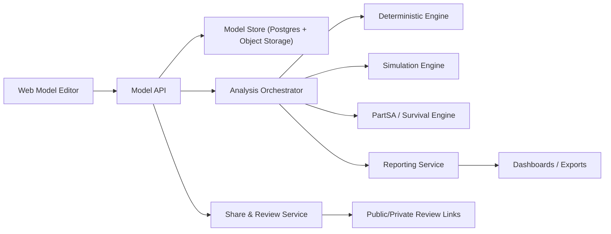

# TreeAge 对标平台研究与搭建准备

更新时间：2026-03-25

## 1. 结论先行

如果你要做一个“类似 TreeAge，但在线可协作、可分析、可建模”的平台，正确的切入点不是先做一个网页画图工具，而是先做这 3 层：

1. 一个可版本化的模型 DSL / IR（模型中间表示）。
2. 一个可复现的分析计算引擎。
3. 一个可分享、可审阅、可审计的 Web 协作层。

TreeAge 现在的真实壁垒不只是“能画决策树”，而是把下面几类能力打通了：

- 建模：Decision Tree、Markov、Patient Simulation、Partitioned Survival、Discrete Event。
- 分析：CEA/ICER/NMB、Markov cohort、Sensitivity、Tornado、PSA、Monte Carlo、风险分布图。
- 验证：cycle 级 trace、dashboard、debug、Excel 输出、校准、hazard/survival 可视化。
- 协作：上传到 TPWeb，用链接分享，允许指定输入可编辑、指定分析可运行。
- 集成：Excel 双向连接、导出 Excel、Object Interface、Python 接入。

如果你一开始就想“全量复刻 TreeAge”，项目会过大。更合理的策略是：

- 第一阶段只做 Healthcare-first。
- 第一版先支持 Decision Tree + Markov + CEA + 一/二/多因素敏感性分析 + Tornado + PSA + Web 分享。
- 第二阶段再做 Patient Simulation、PartSA、Budget Impact、Excel 深度联动。
- 第三阶段再做 DES、Calibration、Hazard 工具、对象接口/API 自动化。

## 2. 我抓到的 TreeAge 核心能力地图

### 2.1 建模范式

TreeAge 官方当前明确支持以下建模范式：

- Decision Trees
- Markov Models
- Patient Simulation
- Partitioned Survival Analysis
- Discrete Event Simulation

官方 Healthcare Features 页面把这些能力放在统一的“Visual platform”下，并强调“no coding”与内置分析能力。[来源](https://www.treeage.com/hc-features/)

其中细分能力包括：

- Markov Wizard、Visual Editor、State Transition Diagram 与 Markov 结构互转。[来源](https://www.treeage.com/hc-features/markov/)
- Patient-level simulation 支持患者特征、患者历史、亚组拆分。[来源](https://www.treeage.com/learn-more/patient-level-markov-simulation/)
- PartSA 支持直接用 survival / hazard curves 驱动状态占比，并自动累计成本与效用。[来源](https://www.treeage.com/hc-features/partsa/)
- 高级培训材料里明确把 DES、PartSA、Patient Simulation、Budget Impact、Calibration 作为进阶能力。[来源](https://files.treeage.com/training/Online-Adv/TreeAge-Advanced-Modeling-Online-Agenda.pdf)

### 2.2 分析与报告能力

TreeAge 当前对外公开的核心分析能力包括：

- Cost-Effectiveness Analysis
- ICER / NMB
- Markov Cohort Analysis
- One-way / Two-way / Multi-way Sensitivity Analysis
- Tornado Diagrams
- Probabilistic Sensitivity Analysis
- Monte Carlo / Microsimulation
- Probability Distribution / Risk Profile
- Acceptability Curves
- ICE Scatterplots
- Price Threshold Analysis
- Budget Impact

关键证据：

- Healthcare Features 页面列出 Cost-Effectiveness、Markov Cohort、Sensitivity、Probabilistic Sensitivity 等内置分析。[来源](https://www.treeage.com/hc-features/)
- Cost-effectiveness 页面明确提到 ICER、NMB，并覆盖 Decision Trees、Markov、PartSA、Patient Simulation、DES。[来源](https://www.treeage.com/hc-features/cost-effectiveness-landing/)
- Sensitivity 页面明确包含 deterministic SA、tornado、PSA、acceptability curves、scatterplots。[来源](https://www.treeage.com/sensitivity-analysis-software/)
- Help 文档说明 PSA + microsimulation 的双层采样逻辑：外层参数采样，内层患者随机游走。[来源](https://www.treeage.com/help/Content/42-Sensitivity-Analysis-on-Microsim-Models/2-PSA-Microsimulation.htm)
- Help 文档说明 business / oil / legal 场景中的概率分布图、累计分布图、比较分布图与风险画像。[来源](https://www.treeage.com/help/Content/31-Analyzing-Decision-Trees/8-Probability-distributions.htm)

### 2.3 透明性、验证与审阅能力

这是 TreeAge 很关键但常被低估的一层。

官方透明性页面强调：

- Dashboard 快速检查模型结构、配置、输入。
- 可以用 TreeAge 重建外部模型做 validation。
- 可以导出到 Excel 做审阅。
- 模型被多个 HTA 机构接受，包括 NICE、PBAC、PHARMAC、ICER、CHUIKYO、CENETEC。[来源](https://www.treeage.com/hc-features/transparency/)

更细节的验证能力包括：

- Markov cohort cycle-by-cycle 报告。[来源](https://www.treeage.com/hc-features/markov/)
- Markov to Excel 导出完整状态/事件/cycle 公式。[来源](https://www.treeage.com/help/Content/24-Markov-to-Excel/0-Intro-Markov-to-Excel.htm)
- Debugging trace、specific cycles/individuals 跟踪。[来源](https://www.treeage.com/news/treeage-pro-2018-r1-release/)
- 随机数发生器技术说明。[来源](https://www.treeage.com/help/Content/90a-Application-Preferences/9-Technical-Details-Random-Number-Generator.htm)
- Reviewer Checklist，用于系统审查 Markov、PSA、PartSA、Patient-level simulation 等模型。[来源](https://files.treeage.com/website/ModelReviewChecklist.pdf)

### 2.4 Web 分享与在线运行能力

TreeAge 的在线部分不是完整云建模，而是“桌面建模 + Web 审阅/分析”模式。

TPWeb 当前公开能力：

- 上传模型后用链接分享。
- 审阅者无需安装桌面软件。
- 审阅者可以查看结构、编辑已开放的输入、运行已开放的分析。[来源](https://www.treeage.com/learn-more/web-sharing/)

TPWeb Help 披露了更具体边界：

- 支持 Decision trees、Markov models、Partitioned Survival、Patient-level simulation / microsimulation。
- 支持 CEA、ICER/NMB、Markov cohort、Tornado、PSA、PartSA。
- 可保存图像和 Excel 报告。
- 受模型大小、内存和分析时长限制，例如 2MB 模型、1.2GB 内存、15 分钟分析时长等。[来源](https://www.treeage.com/help/Content/67-TPWeb-and-Model-Sharing/0-Intro-TPWeb.htm)

这说明你做在线版时，至少要支持：

- 只读审阅模式
- 受控输入编辑
- 受控分析运行
- 结果导出
- 资源配额控制

### 2.5 Excel 与自动化集成能力

TreeAge 与 Excel 的耦合比一般人想象得深：

- 编辑模型输入到 Excel。
- Tree Workbook 输出模型输入到 Excel。
- 输出报告和图到 Excel。
- 动态双向 Bilinks。
- Markov 转 stand-alone Excel。
- 场景结果导出到 Excel。[来源](https://www.treeage.com/help/Content/20-Excel-related-topics/0-Intro-Excel-Rated-Topics.htm)

更细节：

- Bilinks 支持把 Excel 命名单元格映射到 TreeAge 变量。[来源](https://www.treeage.com/help/Content/22-Linking-a-model-to-Excel-Bilinks/2-Get-TreeAge-Input-from-Excel.htm)
- Markov to Excel 支持 editable inputs、tunnel states、within-cycle correction、nested expressions，但不支持 distribution sampling、sensitivity analysis、microsimulation。[来源](https://www.treeage.com/hc-features/markov-to-excel/)

程序化访问方面：

- Object Interface 支持打开、编辑、分析、保存、关闭模型。[来源](https://www.treeage.com/help/Content/25-Using-Object-Interface/1-Object-Interface-API-Documentation.htm)
- Python 可从外部调用对象接口访问模型。[来源](https://www.treeage.com/help/Content/98-Python/6-Python-Access-to-TP-models.htm)

### 2.6 业务 / 法律场景能力

TreeAge 不只做 healthcare，也覆盖 business / law：

- 决策树建模
- 概率与 payoff 建模
- Roll back / Expected Value
- 风险分布图
- Influence Diagram，并可转 Decision Tree
- Legal Model Wizard
- Model Summary PDF

依据：

- Business Features 页面强调 visual design、no coding、built-in analysis tools。[来源](https://www.treeage.com/business-features/)
- Business/Law Help 展示 Roll Back / Expected Value 和 Probability Distribution / Risk Assessment。[来源](https://www.treeage.com/help-bus/Content/0-TP-Bus/3-Build-Legal-Model/6-Analyze-Model.htm)
- Influence Diagram 可创建后转换为决策树。[来源](https://www.treeage.com/help/Content/94-Influence-Diagrams/0-Intro-Influence-Diagrams.htm)
- 2025 年 1 月新增 Legal Model Wizard 与 Model Summary PDF。[来源](https://www.treeage.com/resources/whats-new/)

## 3. TreeAge 最近两年的产品演进，意味着什么

从官方 release / what’s new 看，TreeAge 在 2024-2026 的重点非常清晰：

### 2024-01

- Web-based Model Sharing
- Add Distribution Wizard
- 可把 dashboard 图单独导出

[来源](https://www.treeage.com/resources/whats-new/)

### 2024-07

- Survival Plot
- Web 分享 Patient Simulation
- 对全世界公开分享模型
- DistHazard

[来源](https://www.treeage.com/resources/whats-new/)

### 2025-01

- Markov Model Wizard
- Markov Plot
- Legal Model Wizard
- Model Summary PDF

[来源](https://www.treeage.com/resources/whats-new/)

### 2025-07

- Combine Survival/Hazard Estimates
- TPWeb 支持 PartSA 与 PSA
- 所有输出可导出图和 Excel

[来源](https://www.treeage.com/resources/whats-new/)

### 2026-01

- Markov Calibration to clinical data
- Survival uncertainty visualization
- Latin Hypercube Sampling for PSA

[来源](https://www.treeage.com/resources/whats-new/)

### 对你搭平台的含义

用户现在已经不满足于：

- 只会画树
- 只会出 ICER
- 只能本地桌面跑

市场预期已经变成：

- 要能在线分享
- 要能给非建模人员审阅
- 要能验证与追溯
- 要能处理 survival/hazard 数据
- 要能做复杂不确定性分析
- 要能导出熟悉格式给 payer / reviewer / client

## 4. 你特别提到的 6 个高级能力，官方核实与产品含义

下面 6 个点里，前 5 个在 TreeAge 2026 R1 官方 release 中都被明确列出；第 6 个不仅成立，而且在 2026 R1 已经有明确函数名。

### 4.1 利用临床数据校准马尔可夫模型

官方核实：

- 2026 年 1 月 TreeAge 发布 `Calibrate Markov Models with Clinical Data`。
- 官方明确写的是基于 clinical survival data / K-M tables 自动校准 Markov 模型输入。
- 既支持对已有模型做 calibration，也支持在 Markov Model Wizard 中新建时直接校准。
- 校准后用 Markov Plot 回看模型曲线和临床数据的匹配程度。

证据：

- `Calibrate Markov Models with Clinical Data` 页面。[来源](https://www.treeage.com/hc-features/calibratemarkov/)
- 2026 R1 官方 release note。[来源](https://www.treeage.com/news/treeage-pro-2026-r1/)

对你平台的含义：

- 这不是一个“附加图表功能”，而是一个独立 calibration engine。
- 你需要支持 `target data`、`可校准参数集`、`目标函数`、`优化算法`、`拟合结果可视化` 这 5 个对象。
- 首版可先支持 `KM table -> Markov transition parameter calibration`，不用一开始就支持更复杂多终点联合校准。

### 4.2 马尔可夫图和生存图的敏感性分析模式

官方核实：

- 2026 R1 明确新增 `Sensitivity Analysis Mode for the Markov Plot and Survival Plot`。
- 官方 help 里写得很具体：选择一个输入变量，设置 `base / low / high`，图上同时显示基线和上下界曲线。

证据：

- 2026 R1 官方 release note。[来源](https://www.treeage.com/news/treeage-pro-2026-r1/)
- Markov Plot help 文档。[来源](https://www.treeage.com/help/Content/3-Building-Markov-Models-Topics/8-Markov-Plotter.htm)

对你平台的含义：

- 这类功能比 tornado 更接近“机制解释”，非常适合审阅和和临床讨论。
- 你的图引擎要支持同一图层叠加多条曲线，并保留参数取值元数据。
- 首版建议支持 `单参数 low/base/high`，后续再扩展为滑块和多参数场景集。

### 4.3 拉丁超立方抽样（用于 PSA）

官方核实：

- 2026 R1 明确新增 `Latin Hypercube Sampling (for PSA)`。
- 官方 help 明确说明其目的不是改变 PSA 定义，而是用更少样本更均匀覆盖多维参数空间，提高抽样效率。

证据：

- 2026 R1 官方 release note。[来源](https://www.treeage.com/resources/whats-new/)
- LHS help 文档。[来源](https://www.treeage.com/help/Content/66-Probabilistic-Sensitivty-Analysis-on-CE-Models/12-Latin-Hypercube.htm)

对你平台的含义：

- 这属于 PSA engine 的采样策略，不是单独页面功能。
- 你的 PSA 模块至少要抽象出 `sampler interface`，允许 `random` 和 `lhs` 两种实现。
- 如果以后做 Sobol、quasi-Monte Carlo、correlated sampling，这个抽象会直接复用。

### 4.4 马尔可夫患者追踪队列仪表盘

官方核实：

- 2026 R1 明确新增 `Markov Patient Tracking Cohort Dashboard`。
- 官方描述是从 `Patient Simulation/Microsimulation > Patient Tracking > Cohort Reporting` 生成 cohort dashboard，并支持类似 Markov cohort 的 `collapse state` 能力。

证据：

- 2026 R1 官方 release note。[来源](https://www.treeage.com/news/treeage-pro-2026-r1/)
- What’s New help 文档。[来源](https://www.treeage.com/help/Content/1-Introduction-Topics/Whats-New.htm)
- Patient Tracking help 文档。[来源](https://www.treeage.com/help/Content/41-Patient-Tracking/2-Patient-Tracking-Reports.htm)

对你平台的含义：

- 这本质上是 `patient-level event log -> cohort aggregate visualization`。
- 也就是说，你底层必须能保存患者级轨迹，不能只保留最终汇总结果。
- 如果没有 event log / tracker / time-stamped state records，这个 dashboard 做不出来。

### 4.5 自定义模拟散点图

官方核实：

- 2026 R1 明确新增 `Custom Simulation Scatterplots`。
- 官方描述是：针对 PSA 和 Patient Simulation，任意选择两个输入或输出作为坐标轴，查看关系和相关性。

证据：

- 2026 R1 官方 release note。[来源](https://www.treeage.com/news/treeage-pro-2026-r1/)
- What’s New help 文档。[来源](https://www.treeage.com/help/Content/1-Introduction-Topics/Whats-New.htm)

对你平台的含义：

- 这要求你的模拟结果不是只存“标准报告字段”，而要有一个通用结果仓。
- 建议统一抽象为 `run metrics catalog`，允许任意 distribution sample、model output、incremental output 被索引和绘图。
- 这会显著提升探索式分析能力，也能帮助发现异常样本与结构性相关关系。

### 4.6 利用表格和复合曲线计算事件概率

官方核实：

- 你这个判断成立，而且比“概念级能力”更具体。
- 2025 年 7 月 TreeAge 先上线 `Combine Survival/Hazard Estimates`，允许把 Kaplan-Meier 表、拟合分布和其他 survival/hazard estimate 通过 transition / blend 拼成 compound curve。
- 2026 R1 又明确新增 `Calculate Event Probabilities from Tables and Compound Curves`，并给出 4 个函数：
  - `ProbSurvTable`
  - `ProbHazardTable`
  - `ProbSurvCompCurve`
  - `ProbHazCompCurve`

证据：

- Combine Survival/Hazard Estimates 页面。[来源](https://www.treeage.com/hc-features/combinesurvival/)
- 2026 R1 官方 release note。[来源](https://www.treeage.com/news/treeage-pro-2026-r1/)
- Survival to Hazard help 文档。[来源](https://www.treeage.com/help/Content/87-Hazards/1-Survival-to-Hazard.htm)

对你平台的含义：

- 这不是“表格导入”问题，而是 `证据表示层 -> 概率转换函数层 -> 模型输入层` 的一整条链路。
- 你的平台至少要原生支持：
  - survival tables
  - hazard tables
  - compound curves
  - 从这些对象按周期计算事件概率
- 这是 future-proof 的关键，因为 calibration、PartSA、Markov、DES 都会复用这套能力。

### 4.7 对这 6 个能力的优先级建议

如果按你现在要搭在线平台的视角，我建议优先级如下：

1. `表格/复合曲线 -> 事件概率函数`
2. `Markov calibration`
3. `Markov/Survival plot sensitivity mode`
4. `LHS for PSA`
5. `Custom simulation scatterplots`
6. `Patient tracking cohort dashboard`

原因：

- 前 3 项直接决定你是否具备现代 HEOR 建模能力。
- 第 4 项决定 PSA 效率和专业度。
- 第 5 项增强探索分析体验。
- 第 6 项价值很高，但前提是 patient-level data pipeline 已经成熟。

## 5. 外部资料给出的现实判断

外部文献对 TreeAge 的定位基本一致：

- TreeAge 和 Excel 适合教育、HTA 常见模型和可视化表达。
- 当分析变得更复杂时，R / MATLAB 在透明性、灵活性、复杂分析效率上会更有优势。

直接证据：

- 2017 年 PubMed 综述比较 TreeAge Pro、Excel、R、MATLAB，结论是 TreeAge/Excel 适合教育与 HTA 常规分析，但更复杂分析时，R/MATLAB 在效率和透明性方面更有优势。[来源](https://pubmed.ncbi.nlm.nih.gov/28488257/)
- 2026 年 ISPOR 摘要显示，同一 CEA 在 TreeAge 与 R 中得到方向一致的 CE 结论；R 在透明性和灵活性方面更强，而 TreeAge 在快速模型可视化方面更有优势。[来源](https://www.ispor.org/heor-resources/presentations-database/presentation-cti/ispor-2026/poster-session-5-4/comparing-cost-effectiveness-results-and-implementation-characteristics-of-identical-short-term-ceas-across-modeling-platforms)

这对你最重要的启示是：

- 你的产品如果只复制 TreeAge 的“可视化”，会被更开放的 R/Python 生态反超。
- 你必须把“图形建模体验”与“可审计、可编排、可扩展的计算引擎”绑在一起。
- 最佳策略不是排斥代码，而是做“双轨”：图形界面给大多数人，脚本/API 给高级用户。

## 6. 我建议你的切入方向

### 推荐路线：Healthcare-first，而不是 all-in-one

原因：

- TreeAge 的能力最完整、最有付费意愿的场景在 healthcare / HEOR / HTA。
- 该场景对在线协作、审阅、复现、导出要求更强。
- 业务/法律版的底层其实可复用 decision tree + risk analysis + reporting 这套内核，后上即可。

### 目标用户建议优先级

1. 药企 HEOR / market access 团队
2. 咨询公司 / 卫生经济学团队
3. 医学院校 / HTA 研究者
4. payer / reviewer / 审阅方

### 你的差异化方向

建议不要做“TreeAge web clone”，而要做：

- 在线协作版 TreeAge
- 更现代的 model review / audit / trace
- 更好的 survival / hazard / registry data 接入
- 更开放的 Python/R API
- 更好的团队版权限、版本、审批、复现机制

## 7. MVP 应该做什么，不该做什么

### P0：必须有

- 视觉建模编辑器
- Decision Tree
- Cohort Markov
- 变量 / 分布 / 表格 / 场景集
- CEA：ICER / NMB / rankings
- 1-way / 2-way sensitivity
- Tornado
- PSA
- 基础图表导出
- Web 分享链接
- 审阅模式
- 版本快照
- run provenance：输入、版本、随机种子、运行时间、结果哈希

### P1：第二阶段

- Patient-level simulation / microsimulation
- Survival / hazard import
- PartSA
- Budget Impact
- Price Threshold
- Excel import/export
- reviewer dashboard
- subgroup analysis

### P2：第三阶段

- DES / queue / resource constraints
- calibration to K-M / target survival
- Latin Hypercube sampling
- Object API / SDK
- Python notebook integration
- model summary PDF

### 暂时不要做

- 一开始就复刻全部 business/law 场景
- 一开始就做完整 Excel 双向同步
- 一开始就做所有高级 graph 定制
- 一开始就支持超大复杂模型的高并发云计算

## 8. 产品与技术架构建议



### 7.1 前端

建议：

- React + TypeScript
- 图编辑：React Flow 或基于 Canvas/SVG 自研
- 公式编辑：Monaco Editor
- 图表：Plotly 或 ECharts

前端必须支持：

- 节点/边拖拽与批量编辑
- 模型输入表格视图
- 公式校验与依赖提示
- 分析结果 dashboard
- 审阅模式与注释

### 7.2 后端

建议：

- Python 为主计算后端：FastAPI + Celery/Arq/RQ + Redis
- PostgreSQL 存模型元数据、版本、运行记录、权限
- S3/MinIO 存导出文件与大结果

原因：

- health economics / survival / simulation 生态更偏 Python 科学计算栈
- NumPy / SciPy / pandas / lifelines 能快速落地
- 未来和 notebook / AI / 自动化更容易打通

### 7.3 计算内核

不要让前端直接“保存画布 JSON 然后即席执行”。要先编译为统一 IR。

推荐内核分 4 层：

1. Graph Layer
2. Expression Layer
3. Model IR Layer
4. Execution Layer

其中：

- Graph Layer 存可视化节点和连接
- Expression Layer 存变量、分布、函数、表格引用
- IR Layer 存标准化后的 strategy/state/event/process
- Execution Layer 针对不同 model type 运行不同求解器

### 7.4 分析引擎拆分

建议拆成 4 个 solver：

1. Decision Tree Solver
2. Markov Cohort Solver
3. Microsimulation Solver
4. PartSA Solver

再在上层封装：

- CEA module
- sensitivity module
- tornado module
- PSA module
- budget impact module
- threshold module

这样你后续扩展不会把核心算例搞乱。

## 9. 建议的核心数据模型

最少要有这些实体：

- `Model`
- `ModelVersion`
- `Strategy`
- `Node`
- `Edge`
- `Variable`
- `VariableSet`
- `Distribution`
- `Table`
- `Tracker`
- `AnalysisTemplate`
- `Run`
- `RunInputSnapshot`
- `RunOutput`
- `ShareLink`
- `ReviewComment`
- `Assumption`
- `EvidenceReference`

重点说明：

- `ModelVersion` 必须不可变，保证复现。
- `RunInputSnapshot` 必须保存完整输入，不要只存“当前值引用”。
- `AnalysisTemplate` 要定义哪些分析允许运行、哪些输入允许运改。
- `Assumption` 和 `EvidenceReference` 很重要，这是 HTA 场景的真实需要，不是装饰。

## 10. 关键算法与计算要求

### 9.1 Decision Tree

- rollback / expected value
- 多 payoff 支持
- 概率分布图 / cumulative distributions
- downstream decision optimization

### 9.2 Markov Cohort

- cycle progression
- transition matrices / event pathways
- half-cycle correction
- discounting
- tunnel states
- full cycle trace

### 9.3 Microsimulation

- patient attributes
- patient history
- seeded reproducibility
- tracker / global tracker
- subgroup slicing
- summary + patient-level trace

### 9.4 PartSA

- PFS / OS 曲线输入
- survival / hazard functions
- state occupancy over time
- cost / utility accumulation

### 9.5 Sensitivity / PSA

- one-way / two-way / multi-way
- tornado ranking
- parameter distributions
- Monte Carlo / PSA
- CE acceptability curves
- ICE scatterplots
- LHS 作为增强项

## 11. 你最容易低估的 8 个难点

1. 数值一致性。不同 solver、折现、半周期修正、事件发生时点的定义，都会导致结果差异。
2. 公式系统。变量引用、作用域、scenario 覆盖、表格时间索引会很快复杂化。
3. traceability。没有可回放 trace，审阅与监管场景很难成立。
4. 共享安全。公开分享链接必须限制输入编辑范围、运行配额和导出权限。
5. 长任务执行。PSA / microsimulation 很容易跑到分钟级，必须异步化。
6. 图形编辑与计算语义分离。如果两者耦合太深，后续每加一种模型都会重构。
7. survival/hazard 数据处理。不同来源的 K-M 表、分布拟合、参数化方式差异很大。
8. 监管/审阅预期。目标用户不只要“跑出来”，还要“解释得清楚、查得出来、复得现”。

## 12. 推荐的 6 个月落地路线

### 第 1 个月：需求冻结与算例基准

- 定义目标用户与首发场景
- 选 10-15 个标准算例
- 固化模型 IR
- 定义分析结果与 trace 输出格式

### 第 2-3 个月：MVP 内核

- Decision Tree solver
- Markov Cohort solver
- CEA / ICER / NMB
- sensitivity / tornado
- 版本化模型存储

### 第 4 个月：Web 分享与审阅

- share links
- review mode
- comments
- exports
- run history

### 第 5 个月：PSA 与云运行

- distributions
- PSA
- job queue
- reproducible seeds
- result dashboards

### 第 6 个月：试点客户可用版

- 2-3 个真实项目试跑
- 建立 reviewer checklist
- 做 Excel / CSV 导入导出
- 补文档与 onboarding

## 13. 我建议你立刻做的准备动作

### 产品准备

- 明确你要打的第一市场：HEOR/HTA 还是泛决策分析
- 先定义 5 个代表性模型模板
- 把审阅流、分享流、导出流写出来

### 技术准备

- 先做模型 IR 设计，不要先做 UI
- 先做 10 个基准算例和 expected outputs
- 先做 deterministic engine，再做 simulation
- 从 Day 1 就设计 run provenance 与 trace

### 商业准备

- 决定你卖的是 desktop replacement、collaboration layer，还是 HTA-ready platform
- 提前考虑 reviewer / payer / consulting team 的 seat 模式
- 在线分享功能会成为非常强的销售抓手

## 14. 如果我是你，我会这样定义首版产品

一句话：

> 一个面向 HEOR/HTA 团队的在线决策建模与审阅平台，支持可视化建模、Markov/Decision Tree 分析、CEA/PSA、版本追踪和链接分享。

首版最小卖点：

- 比 TreeAge 更容易在线协作
- 比 Excel 更可审计
- 比纯 R 更容易让非程序化用户接受

## 15. 首版工程拆分建议

建议从一开始就按“编辑器层、模型层、计算层、报告层、协作层”拆仓或拆模块，而不是按页面拆。

### 推荐目录结构

```text
apps/
  web/
  worker/
services/
  model-api/
  analysis-orchestrator/
packages/
  model-ir/
  expression-engine/
  decision-tree-solver/
  markov-solver/
  psa-engine/
  reporting/
  auth-and-sharing/
infra/
  docker/
  terraform/
docs/
  benchmark-models/
  validation-cases/
```

### 每个模块的职责

- `web`：建模画布、输入表格、分析页、审阅页
- `model-api`：模型 CRUD、版本、权限、分享链接
- `analysis-orchestrator`：任务分发、配额、缓存、失败重试
- `model-ir`：标准化模型结构定义
- `expression-engine`：变量、作用域、函数、表格、分布解析
- `decision-tree-solver`：rollback、expected values、strategy compare
- `markov-solver`：cohort trace、cost/utility、discounting、half-cycle correction
- `psa-engine`：参数采样、批量运行、汇总图表
- `reporting`：图表、Excel/CSV、PDF 摘要
- `auth-and-sharing`：团队、角色、公开链接、审阅权限

## 16. MVP 验收标准建议

首版不要用“功能有没有”做验收，要用“模型能不能稳定复现”做验收。

### 最小验收标准

- 同一模型、同一版本、同一输入、同一随机种子，重复运行结果一致
- 10 个基准算例全部在容差内复现预期结果
- Decision Tree 与 Markov 都能导出结构、输入与结果摘要
- 审阅链接能限制可编辑输入范围
- 长任务支持异步执行、排队、取消和重试
- 运行记录能追溯模型版本、输入快照、执行器版本和输出文件

### 建议你先准备的 5 个 benchmark 模型

1. 单纯 Decision Tree 的二策略 CEA
2. 三状态 cohort Markov 肿瘤模型
3. 含 tunnel state 的慢病 Markov 模型
4. 带 PSA 的标准 HTA 模型
5. 一个基础 PartSA 肿瘤生存模型

## 17. 本次研究使用的关键来源

### 官方能力与帮助文档

- TreeAge 首页与功能总览：[https://www.treeage.com/](https://www.treeage.com/)
- Healthcare Features：[https://www.treeage.com/hc-features/](https://www.treeage.com/hc-features/)
- Markov：[https://www.treeage.com/hc-features/markov/](https://www.treeage.com/hc-features/markov/)
- Cost-Effectiveness：[https://www.treeage.com/hc-features/cost-effectiveness-landing/](https://www.treeage.com/hc-features/cost-effectiveness-landing/)
- PartSA：[https://www.treeage.com/hc-features/partsa/](https://www.treeage.com/hc-features/partsa/)
- Patient Simulation：[https://www.treeage.com/learn-more/patient-level-markov-simulation/](https://www.treeage.com/learn-more/patient-level-markov-simulation/)
- Transparency：[https://www.treeage.com/hc-features/transparency/](https://www.treeage.com/hc-features/transparency/)
- Web Sharing / TPWeb：[https://www.treeage.com/learn-more/web-sharing/](https://www.treeage.com/learn-more/web-sharing/)
- TPWeb Help：[https://www.treeage.com/help/Content/67-TPWeb-and-Model-Sharing/0-Intro-TPWeb.htm](https://www.treeage.com/help/Content/67-TPWeb-and-Model-Sharing/0-Intro-TPWeb.htm)
- Excel 相关帮助：[https://www.treeage.com/help/Content/20-Excel-related-topics/0-Intro-Excel-Rated-Topics.htm](https://www.treeage.com/help/Content/20-Excel-related-topics/0-Intro-Excel-Rated-Topics.htm)
- Bilinks：[https://www.treeage.com/help/Content/22-Linking-a-model-to-Excel-Bilinks/2-Get-TreeAge-Input-from-Excel.htm](https://www.treeage.com/help/Content/22-Linking-a-model-to-Excel-Bilinks/2-Get-TreeAge-Input-from-Excel.htm)
- Markov to Excel：[https://www.treeage.com/hc-features/markov-to-excel/](https://www.treeage.com/hc-features/markov-to-excel/)
- Probability Distributions：[https://www.treeage.com/help/Content/31-Analyzing-Decision-Trees/8-Probability-distributions.htm](https://www.treeage.com/help/Content/31-Analyzing-Decision-Trees/8-Probability-distributions.htm)
- Influence Diagrams：[https://www.treeage.com/help/Content/94-Influence-Diagrams/0-Intro-Influence-Diagrams.htm](https://www.treeage.com/help/Content/94-Influence-Diagrams/0-Intro-Influence-Diagrams.htm)
- Object Interface：[https://www.treeage.com/help/Content/25-Using-Object-Interface/1-Object-Interface-API-Documentation.htm](https://www.treeage.com/help/Content/25-Using-Object-Interface/1-Object-Interface-API-Documentation.htm)
- Python Access：[https://www.treeage.com/help/Content/98-Python/6-Python-Access-to-TP-models.htm](https://www.treeage.com/help/Content/98-Python/6-Python-Access-to-TP-models.htm)
- What’s New：[https://www.treeage.com/resources/whats-new/](https://www.treeage.com/resources/whats-new/)

### 官方培训 / 材料

- Advanced Healthcare Modeling Agenda：[https://files.treeage.com/training/Online-Adv/TreeAge-Advanced-Modeling-Online-Agenda.pdf](https://files.treeage.com/training/Online-Adv/TreeAge-Advanced-Modeling-Online-Agenda.pdf)
- Healthcare Modeling Course Agenda：[https://files.treeage.com/training/Online-HC/TreeAge-Healthcare-Modeling-Online-Agenda.pdf](https://files.treeage.com/training/Online-HC/TreeAge-Healthcare-Modeling-Online-Agenda.pdf)
- Model Review Checklist：[https://files.treeage.com/website/ModelReviewChecklist.pdf](https://files.treeage.com/website/ModelReviewChecklist.pdf)

### 外部比较资料

- PubMed 2017 比较 TreeAge / Excel / R / MATLAB：[https://pubmed.ncbi.nlm.nih.gov/28488257/](https://pubmed.ncbi.nlm.nih.gov/28488257/)
- ISPOR 2026 TreeAge vs R 摘要：[https://www.ispor.org/heor-resources/presentations-database/presentation-cti/ispor-2026/poster-session-5-4/comparing-cost-effectiveness-results-and-implementation-characteristics-of-identical-short-term-ceas-across-modeling-platforms](https://www.ispor.org/heor-resources/presentations-database/presentation-cti/ispor-2026/poster-session-5-4/comparing-cost-effectiveness-results-and-implementation-characteristics-of-identical-short-term-ceas-across-modeling-platforms)
