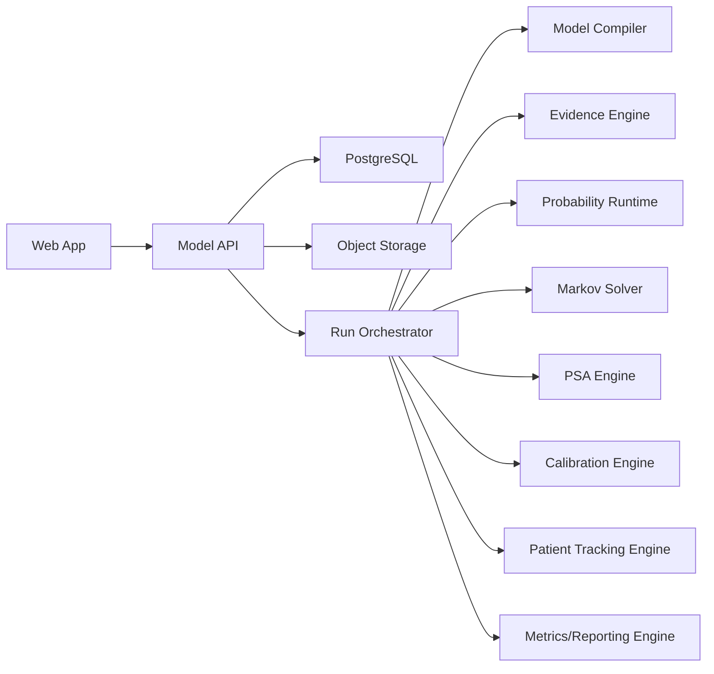
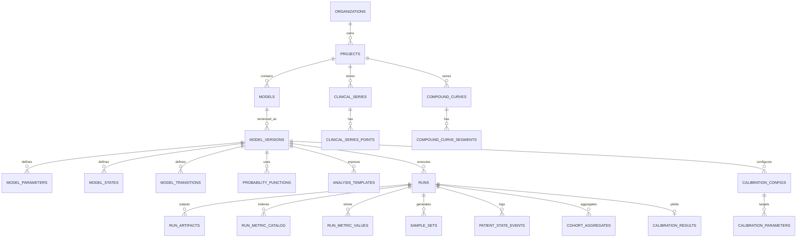

# 平台数据库表结构与计算引擎模块设计

更新时间：2026-03-25
适用范围：面向 HEOR / HTA 在线建模平台 v1

## 1. 设计目标

本设计服务于以下 6 个能力：

1. 临床数据校准马尔可夫模型
2. Markov / Survival Plot 敏感性分析模式
3. PSA 的拉丁超立方抽样
4. 患者追踪队列仪表盘
5. 自定义模拟散点图
6. 表格与复合曲线到事件概率的转换

核心要求：

- 模型版本不可变
- 证据对象标准化
- 运行结果可复现
- 图表和报告全部可追溯
- 计算内核和 UI 配置解耦

## 2. 总体架构



## 3. 数据库设计原则

### 3.1 统一版本边界

- 所有运行都基于 `model_version_id`
- `model_versions` 一旦发布不可更新，只能派生
- 参数集变更通过 `parameter_sets` 或新版本承载

### 3.2 统一证据层

- 生存表、风险表、hazard 表、compound curves 都归入 `evidence` 域
- 事件概率函数不直接依赖上传文件，而依赖标准化 evidence object

### 3.3 统一运行层

- 所有分析都进入 `runs`
- PSA、calibration、plot sensitivity、patient dashboard 都是 `analysis_type`
- 大体量结果通过 object storage 存储，数据库保存索引和元数据

### 3.4 统一指标层

- 图表、散点图、dashboard 全部从 `metrics catalog + metric values` 生成
- 不允许前端直接计算不可回溯指标

## 4. 核心实体关系



## 5. 核心表结构

### 5.1 平台与项目层

#### `organizations`

- `id uuid pk`
- `name text not null`
- `slug text unique not null`
- `created_at timestamptz not null`

#### `projects`

- `id uuid pk`
- `organization_id uuid not null`
- `name text not null`
- `slug text not null`
- `domain text not null default 'healthcare'`
- `created_by uuid`
- `created_at timestamptz not null`

### 5.2 模型与版本层

#### `models`

- `id uuid pk`
- `project_id uuid not null`
- `name text not null`
- `model_family text not null`
  - `decision_tree`
  - `markov`
  - `partsa`
  - `microsim`
- `current_version_id uuid null`
- `created_by uuid`
- `created_at timestamptz not null`

#### `model_versions`

- `id uuid pk`
- `model_id uuid not null`
- `version_no integer not null`
- `status text not null`
  - `draft`
  - `released`
  - `archived`
- `base_version_id uuid null`
- `graph_json jsonb not null`
- `model_ir_json jsonb not null`
- `expression_catalog_json jsonb not null`
- `compiled_hash text not null`
- `engine_compat_version text not null`
- `created_by uuid`
- `created_at timestamptz not null`

索引建议：

- `(model_id, version_no)` unique
- `(compiled_hash)`

#### `model_parameters`

- `id uuid pk`
- `model_version_id uuid not null`
- `code text not null`
- `label text not null`
- `data_type text not null`
- `unit text null`
- `value_kind text not null`
  - `scalar`
  - `distribution`
  - `formula`
  - `table_lookup`
  - `probability_function`
- `default_numeric_value numeric null`
- `default_text_value text null`
- `formula_expr text null`
- `distribution_json jsonb null`
- `bounds_json jsonb null`
- `metadata_json jsonb not null default '{}'`
- `is_random boolean not null default false`
- `is_calibratable boolean not null default false`

索引建议：

- `(model_version_id, code)` unique
- `(model_version_id, is_calibratable)`

#### `model_states`

- `id uuid pk`
- `model_version_id uuid not null`
- `code text not null`
- `label text not null`
- `state_type text not null`
- `group_code text null`
- `sort_order integer not null`

#### `model_transitions`

- `id uuid pk`
- `model_version_id uuid not null`
- `from_state_code text not null`
- `to_state_code text not null`
- `transition_type text not null`
- `probability_expr text null`
- `probability_function_id uuid null`
- `trigger_expr text null`
- `metadata_json jsonb not null default '{}'`

说明：

- 当转移由 evidence function 驱动时，`probability_function_id` 有值
- 当转移由内部公式驱动时，`probability_expr` 有值

### 5.3 证据层

#### `clinical_series`

- `id uuid pk`
- `project_id uuid not null`
- `name text not null`
- `series_kind text not null`
  - `km_survival`
  - `survival_table`
  - `hazard_table`
  - `risk_table`
  - `external_curve`
- `time_unit text not null`
- `value_unit text not null`
- `interpolation_method text not null default 'piecewise_linear'`
- `source_file_uri text null`
- `source_metadata_json jsonb not null default '{}'`
- `created_by uuid`
- `created_at timestamptz not null`

#### `clinical_series_points`

- `id bigserial pk`
- `series_id uuid not null`
- `seq_no integer not null`
- `time_value numeric not null`
- `estimate_value numeric null`
- `lower_ci numeric null`
- `upper_ci numeric null`
- `at_risk integer null`
- `events integer null`
- `censored integer null`
- `metadata_json jsonb not null default '{}'`

索引建议：

- `(series_id, seq_no)` unique
- `(series_id, time_value)`

#### `curve_fits`

- `id uuid pk`
- `series_id uuid not null`
- `fit_family text not null`
  - `exponential`
  - `weibull`
  - `gompertz`
  - `loglogistic`
  - `spline`
- `params_json jsonb not null`
- `fit_stats_json jsonb not null`
- `created_at timestamptz not null`

#### `compound_curves`

- `id uuid pk`
- `project_id uuid not null`
- `name text not null`
- `curve_kind text not null`
  - `survival`
  - `hazard`
- `time_unit text not null`
- `definition_json jsonb not null`
- `created_by uuid`
- `created_at timestamptz not null`

#### `compound_curve_segments`

- `id uuid pk`
- `compound_curve_id uuid not null`
- `seq_no integer not null`
- `segment_kind text not null`
  - `series`
  - `fit`
  - `compound_curve_ref`
- `source_ref_id uuid not null`
- `start_time numeric not null`
- `end_time numeric null`
- `blend_mode text not null default 'hard_switch'`
- `blend_window numeric null`
- `transform_json jsonb not null default '{}'`

### 5.4 概率函数层

#### `probability_functions`

- `id uuid pk`
- `model_version_id uuid not null`
- `name text not null`
- `function_kind text not null`
  - `prob_surv_table`
  - `prob_hazard_table`
  - `prob_surv_comp_curve`
  - `prob_haz_comp_curve`
- `source_type text not null`
  - `clinical_series`
  - `compound_curve`
- `source_ref_id uuid not null`
- `cycle_length numeric not null`
- `time_unit text not null`
- `interpolation_method text not null`
- `options_json jsonb not null default '{}'`
- `created_at timestamptz not null`

说明：

- `probability_functions` 是表达式系统和 solver 之间的桥
- 首版不把概率换算硬编码在 UI 或单个 solver 中

### 5.5 分析模板与运行层

#### `analysis_templates`

- `id uuid pk`
- `model_version_id uuid not null`
- `analysis_type text not null`
  - `markov_cohort`
  - `microsim`
  - `psa`
  - `calibration`
  - `plot_sensitivity`
  - `patient_dashboard`
- `name text not null`
- `config_json jsonb not null`
- `allowed_overrides_json jsonb not null default '{}'`
- `created_by uuid`
- `created_at timestamptz not null`

#### `runs`

- `id uuid pk`
- `project_id uuid not null`
- `model_version_id uuid not null`
- `analysis_type text not null`
- `template_id uuid null`
- `parent_run_id uuid null`
- `status text not null`
  - `queued`
  - `running`
  - `succeeded`
  - `failed`
  - `cancelled`
- `engine_version text not null`
- `random_seed bigint null`
- `sampling_method text null`
- `input_snapshot_json jsonb not null`
- `config_json jsonb not null`
- `summary_json jsonb not null default '{}'`
- `error_log text null`
- `submitted_by uuid`
- `submitted_at timestamptz not null`
- `started_at timestamptz null`
- `finished_at timestamptz null`

索引建议：

- `(model_version_id, analysis_type, submitted_at desc)`
- `(status, submitted_at)`
- `(parent_run_id)`

#### `run_artifacts`

- `id uuid pk`
- `run_id uuid not null`
- `artifact_type text not null`
  - `plot_png`
  - `plot_csv`
  - `sample_matrix`
  - `calibration_overlay`
  - `patient_trace_parquet`
  - `report_pdf`
- `storage_uri text not null`
- `checksum text null`
- `metadata_json jsonb not null default '{}'`
- `created_at timestamptz not null`

### 5.6 指标与散点图层

#### `run_metric_catalog`

- `id uuid pk`
- `run_id uuid not null`
- `metric_key text not null`
- `metric_label text not null`
- `metric_scope text not null`
  - `input_sample`
  - `model_output`
  - `incremental_output`
  - `patient_output`
  - `cohort_output`
- `data_type text not null`
- `unit text null`
- `strategy_code text null`
- `comparator_strategy_code text null`
- `metadata_json jsonb not null default '{}'`

索引建议：

- `unique index on (run_id, metric_key, coalesce(strategy_code,''), coalesce(comparator_strategy_code,''))`

#### `run_metric_values`

- `id bigserial pk`
- `run_id uuid not null`
- `sample_index integer not null`
- `metric_catalog_id uuid not null`
- `numeric_value double precision null`
- `text_value text null`
- `created_at timestamptz not null`

索引建议：

- `(run_id, metric_catalog_id, sample_index)`
- `(run_id, sample_index)`

建议：

- 大样本下对 `run_metric_values` 按 `run_id` 做分区
- 冷数据可落 object storage / parquet，数据库存热数据与索引

### 5.7 PSA 与抽样层

#### `sample_sets`

- `id uuid pk`
- `run_id uuid not null`
- `sampler_type text not null`
  - `random`
  - `lhs`
- `sample_size integer not null`
- `dimension_count integer not null`
- `random_seed bigint not null`
- `storage_uri text not null`
- `checksum text not null`
- `created_at timestamptz not null`

说明：

- 样本矩阵可直接存 parquet/csv.gz
- 如果要画输入变量散点图，则相关列应同步索引到 `run_metric_values`

### 5.8 Calibration 层

#### `calibration_configs`

- `id uuid pk`
- `model_version_id uuid not null`
- `name text not null`
- `target_series_id uuid not null`
- `objective_type text not null`
  - `weighted_sse`
- `optimizer_type text not null`
  - `de`
  - `nelder_mead`
  - `de_plus_nm`
- `max_iterations integer not null`
- `config_json jsonb not null`
- `created_by uuid`
- `created_at timestamptz not null`

#### `calibration_parameters`

- `id uuid pk`
- `calibration_config_id uuid not null`
- `parameter_code text not null`
- `lower_bound numeric not null`
- `upper_bound numeric not null`
- `initial_value numeric null`
- `transform_type text not null default 'identity'`
- `is_fixed boolean not null default false`

#### `calibration_results`

- `run_id uuid pk`
- `calibration_config_id uuid not null`
- `convergence_status text not null`
- `best_objective_value numeric not null`
- `best_params_json jsonb not null`
- `diagnostics_json jsonb not null`
- `overlay_artifact_id uuid null`
- `created_at timestamptz not null`

可选增强：

- `calibration_candidate_history`
- 用于回放优化轨迹和调试

### 5.9 患者追踪层

#### `patient_entities`

- `id bigserial pk`
- `run_id uuid not null`
- `patient_index integer not null`
- `baseline_json jsonb not null`
- `subgroup_key text null`
- `created_at timestamptz not null`

#### `patient_state_events`

- `id bigserial pk`
- `run_id uuid not null`
- `patient_index integer not null`
- `event_seq integer not null`
- `cycle_index integer null`
- `event_time numeric not null`
- `from_state_code text null`
- `to_state_code text null`
- `event_type text not null`
- `tracker_json jsonb not null default '{}'`
- `created_at timestamptz not null`

索引建议：

- `(run_id, patient_index, event_seq)` unique
- `(run_id, event_time)`
- `(run_id, to_state_code, event_time)`

#### `cohort_aggregates`

- `id bigserial pk`
- `run_id uuid not null`
- `bucket_time numeric not null`
- `state_code text not null`
- `subgroup_key text null`
- `occupancy_count integer not null`
- `inflow_count integer not null default 0`
- `outflow_count integer not null default 0`
- `metric_json jsonb not null default '{}'`

索引建议：

- `(run_id, bucket_time, state_code, subgroup_key)`

## 6. 关键索引与分区策略

### 高频查询

- 模型版本加载：`model_versions`, `model_parameters`, `model_transitions`
- 证据对象读取：`clinical_series_points`
- dashboard 与散点图：`run_metric_values`, `cohort_aggregates`
- 患者 drill-down：`patient_state_events`

### 建议分区

- `run_metric_values` 按 `run_id` 或时间范围分区
- `patient_state_events` 按 `run_id` 分区
- `clinical_series_points` 通常无需分区

## 7. 计算引擎模块设计

### 7.1 模块总览

| 模块 | 责任 | 输入 | 输出 |
|---|---|---|---|
| `model-compiler` | Graph/Expression 编译到 IR | graph_json + expressions | compiled model IR |
| `evidence-engine` | 解析 tables/curves | uploaded data | standard evidence object |
| `probability-runtime` | 证据转周期概率 | evidence object + cycle window | event probability |
| `markov-solver` | cohort Markov 计算 | model IR + inputs | trace + outcomes |
| `psa-engine` | sample generation 和批量运行 | distributions + solver | sample outputs |
| `calibration-engine` | 参数拟合 | target data + solver | best-fit params |
| `patient-tracking-engine` | patient event log 和聚合 | microsim events | cohort dashboard data |
| `metrics-engine` | 建立指标目录与查询 | run outputs | catalog + values |
| `reporting-engine` | 图表和导出 | run data | plots / CSV / PDF |

### 7.2 `model-compiler`

职责：

- 解析图结构
- 校验表达式依赖
- 生成标准化 `model_ir`

建议输出结构：

- strategies
- states
- transitions
- parameter refs
- trackers
- analysis defaults

### 7.3 `evidence-engine`

职责：

- 读取 survival/hazard tables
- 标准化时间单位
- 数据清洗与排序
- 生成 `ClinicalSeries`
- 构建 `CompoundCurve`

核心接口：

```text
parseClinicalSeries(file, seriesKind, timeUnit) -> ClinicalSeries
fitParametricCurve(seriesId, family, options) -> CurveFit
buildCompoundCurve(segments, rules) -> CompoundCurve
```

### 7.4 `probability-runtime`

职责：

- 将 survival/hazard 对象转换为周期事件概率
- 为 solver、plot、calibration 提供一致计算

核心公式：

- 从 survival：
  - `p(t0, t1) = 1 - S(t1) / S(t0)`
- 从 hazard：
  - `p(t0, t1) = 1 - exp(-Integral[h(u), u=t0..t1])`

核心接口：

```text
evaluateProbability(functionId, t0, t1, context) -> float
debugProbability(functionId, t0, t1) -> DebugTrace
```

### 7.5 `markov-solver`

职责：

- cohort state propagation
- transition probability evaluation
- half-cycle correction
- discounting
- cost/utility accumulation

核心输出：

- cycle trace
- state occupancy
- costs / qalys / lys
- strategy comparison

### 7.6 `psa-engine`

职责：

- 根据参数分布生成 sample set
- 调用 solver 批量运行
- 写入 sample outputs 和 summary metrics

接口建议：

```text
generateSampleSet(method, parameters, sampleSize, seed) -> SampleSet
runPSA(modelVersionId, sampleSetId, config) -> RunResult
```

实现建议：

- `sampler` 抽象成策略接口
- `RandomSampler`
- `LatinHypercubeSampler`

### 7.7 `calibration-engine`

职责：

- 调用 solver 计算模型预测曲线
- 与 target data 比较
- 驱动优化器更新参数

推荐流程：

1. 从 `calibration_config` 读取参数边界和目标数据
2. 用 `global optimizer` 搜索候选点
3. 用 `local optimizer` 精修
4. 记录 best params
5. 生成 overlay artifact

核心接口：

```text
runCalibration(configId, modelVersionId) -> CalibrationResult
scoreCandidate(candidateParams, targetSeriesId) -> ObjectiveValue
```

### 7.8 `patient-tracking-engine`

职责：

- 写入 patient-level event log
- 汇总为 cohort aggregates
- 供 dashboard 和 drill-down 使用

输出对象：

- patient event log
- occupancy time series
- inflow/outflow counts
- subgroup views

### 7.9 `metrics-engine`

职责：

- 从 sample inputs、model outputs、incremental outputs 生成统一指标目录
- 支持 scatterplot、dashboard、导出复用

关键设计：

- 不用为每张图单独存字段
- 统一用 `metric_key + sample_index + value`

### 7.10 `reporting-engine`

职责：

- plot sensitivity overlay
- calibration overlay
- custom scatterplots
- CEAC / ICE / CSV / PDF 导出

## 8. 六大能力与模块映射

| 能力 | 依赖模块 |
|---|---|
| 临床校准 | evidence-engine, probability-runtime, markov-solver, calibration-engine, reporting-engine |
| Plot sensitivity | markov-solver, probability-runtime, reporting-engine |
| LHS for PSA | psa-engine, metrics-engine |
| Patient dashboard | patient-tracking-engine, metrics-engine, reporting-engine |
| Custom scatterplot | metrics-engine, reporting-engine |
| Event probabilities | evidence-engine, probability-runtime |

## 9. API 设计建议

### 9.1 Evidence

- `POST /projects/:id/clinical-series`
- `POST /projects/:id/compound-curves`
- `GET /clinical-series/:id`
- `GET /compound-curves/:id`

### 9.2 Probability Functions

- `POST /model-versions/:id/probability-functions`
- `POST /probability-functions/:id/debug`

### 9.3 Runs

- `POST /model-versions/:id/runs`
- `GET /runs/:id`
- `GET /runs/:id/artifacts`
- `GET /runs/:id/metrics`

### 9.4 Calibration

- `POST /model-versions/:id/calibration-configs`
- `POST /calibration-configs/:id/run`
- `GET /runs/:id/calibration-result`

### 9.5 Scatterplot

- `GET /runs/:id/scatterplot?x=...&y=...`

### 9.6 Patient Tracking

- `GET /runs/:id/cohort-dashboard`
- `GET /runs/:id/patients/:patient_index/trace`

## 10. 建议的实现顺序

### Phase 1

- `model-compiler`
- `evidence-engine`
- `probability-runtime`
- `markov-solver`

### Phase 2

- `psa-engine`
- `metrics-engine`
- `reporting-engine`

### Phase 3

- `calibration-engine`
- `patient-tracking-engine`

## 11. 风险与规避

### 风险 1：把曲线能力散落到各 solver

后果：

- 公式重复
- 结果不一致
- plot 和 solver 算法偏差

规避：

- 强制所有曲线到概率的换算走 `probability-runtime`

### 风险 2：只保存汇总结果，不保存 sample/patient 细节

后果：

- scatterplot 做不起来
- patient dashboard 做不起来
- 无法审阅异常值

规避：

- 首版就设计 `run_metric_values` 和 `patient_state_events`

### 风险 3：模型版本可变

后果：

- 无法复现
- 共享链接结果漂移

规避：

- `model_versions` immutable

## 12. 建议的最低 SQL 交付

建议至少先实现：

- `models`
- `model_versions`
- `model_parameters`
- `model_states`
- `model_transitions`
- `clinical_series`
- `clinical_series_points`
- `compound_curves`
- `compound_curve_segments`
- `probability_functions`
- `runs`
- `run_artifacts`
- `run_metric_catalog`
- `run_metric_values`
- `sample_sets`
- `calibration_configs`
- `calibration_parameters`
- `calibration_results`
- `patient_state_events`
- `cohort_aggregates`

附：核心 SQL 草案见 [平台核心表结构_v1.sql](/Users/linzhang/Desktop/%20%20%20%20%20%20OPC/平台核心表结构_v1.sql)
